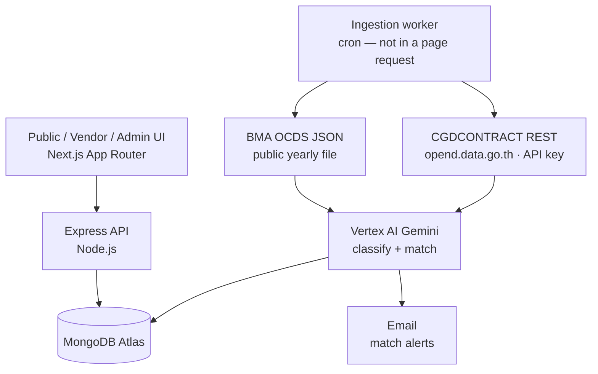

# Software Requirements Specification

**Product:** TORRENT — Software TOR Monitor  
**Version:** 1.0  
**Status:** Initial complete draft  
**Prepared by:** Team Torrent, Department of Computer Engineering, Kasetsart University  
**Date:** 24 August 2026

| Version | Date | Reason for changes |
| --- | --- | --- |
| 1.0 | 24 Aug 2026 | Initial complete draft. |

---

## 0. Overview

Thai government software procurement is already public. Finding it is the work. Notices sit in OCDS dumps and the national e-GP spending API, mixed with roads, events, and office supplies. There is no software-only desk, no match for a small studio, and no public median that makes an odd budget visible.

TORRENT is a **reversed job board** and a **public monitor** of official software TORs:

1. Ingest official machine feeds on a schedule.  
2. Keep software-relevant records only (keywords + AI + human review).  
3. Normalize them into one TOR record and keep the official source URL.  
4. Match registered vendor profiles and notify on draft or published when that stage exists.  
5. Show budget vs category median, integrity flags, and past approaches.

Anyone can read the monitor. Matching, watchlist, and alerts sit behind vendor sign-in. Operators keep feeds and classification honest. Bidding stays on the official government site.

This document is the testable specification: users, sources, stories, use cases, and functional / non-functional requirements.

---

## 1. Introduction

### 1.1 Purpose

This SRS describes TORRENT so the development team, advisor, and stakeholders share one contract: what the system shall do, what it shall not do, and how success is judged.

### 1.2 Scope

**Product name:** TORRENT

**Coverage — five organizations, two official procurement data sources**

| # | Organization | Short | Binding source |
| --- | --- | --- | --- |
| 1 | Bangkok Metropolitan Administration | BMA / กทม. | **BMA Open Contracting OCDS** — public yearly JSON (planning / tender / award / contract where the package includes them) |
| 2 | Ministry of Digital Economy and Society | MDES / ดีอี | **CGDCONTRACT** REST API (same endpoint as 3–5), filtered by department + software keywords |
| 3 | Digital Government Development Agency | DGA / สพร. | Same **CGDCONTRACT** API |
| 4 | Digital Economy Promotion Agency | depa / สศด. | Same **CGDCONTRACT** API |
| 5 | Electronic Transactions Development Agency | ETDA / สพธอ. | Same **CGDCONTRACT** API |

MDES, DGA, depa, and ETDA do **not** each have a procurement API. They are buyers inside one national e-GP dump published as CGDCONTRACT.

**The system shall**

- Schedule-ingest OCDS JSON and CGDCONTRACT (API key on the server).  
- Deduplicate, store source URL and source kind, version lifecycle: draft → published → awarded.  
- Classify software relevance; queue low-confidence items for admin.  
- Expose a no-login public monitor, listings, budget dashboard, and approaches gallery.  
- Let vendors register, maintain a capability profile, receive matches, watch listings, and set alert rules.  
- Show capability-fit overlap on vendor TOR detail.  
- Let admins watch source health and correct classification.

**The system shall not (v1)**

- Submit bids or collect bid prices. Apply stays on the official listing.  
- Promise TOR PDFs from CGDCONTRACT. That API returns project / contract fields (name, department, type, budget, winner, dates), not a TOR document store.  
- Invent draft stage for award-only CGDCONTRACT rows.  
- Scrape agency websites (`dga.or.th`, `depa.or.th`, `mdes.go.th`, `egp2.bangkok.go.th`, etc.).  
- Give legal or procurement-compliance advice. An integrity flag is a question, not a verdict.  
- Guarantee 100% classification accuracy.  
- Cover BMTA or other bodies with a separate procurement system unless added later.

### 1.3 Intended audience

| Audience | Start at |
| --- | --- |
| Development / QA | Sections 2, 4, 6–9 |
| Advisor / examiner | Sections 1.2, 4, 6 |
| Platform owner | Sections 0, 3, 11 |
| Vendors | Sections 2.2, 6.2 |
| Agency staff | Section 6.4, UC-12 |

### 1.4 Conventions

- **Shall** = mandatory for this release. **[Prototype]** = may be stubbed (mock data, pass-through login) while behaviour remains the target.  
- **Should** = expected quality; not a launch blocker if a workaround is documented.  
- **Could** = later increment.  
- US-n = user story. UC-n = use case. FR-n / NFR-n = requirements.

---

## 2. Overall description

### 2.1 Product perspective

Standalone web app plus a scheduled worker. TORRENT does not replace e-GP.

Official listing URLs are outbound only (human apply / verify). They are never scraped for payload.

### 2.2 User classes

| Class | Who | Login | Primary goals |
| --- | --- | --- | --- |
| **Public visitor** | Anyone: press, civic groups, students, department staff | No | Read software TORs, flags, budget context |
| **Vendor** | Studios, freelancers, agencies | Yes | Early matches, fit, alerts, watchlist |
| **Admin** | Torrent operators | Yes (ops) | Feed health, classification queue, account hygiene |
| **Platform owner** | Product / course lead | Ops | Metrics, coverage config |
| **Agency representative** | Staff at one of the five organizations | Optional in v1 | Check the public record; flag errors |

**Technical actors:** ingestion worker, Gemini, email provider, OCDS host, CGDCONTRACT.

### 2.3 Operating environment

Next.js App Router · Node.js / Express · MongoDB Atlas · Vertex AI (Gemini) · EN/TH · current Chrome and Firefox · usable from 1280×720 and on common mobile widths. Frontend may deploy on Vercel; worker and API deploy separately.

### 2.4 Constraints

- API / official JSON only. No Playwright against government HTML.  
- Every TOR stores `sourceKind`, `sourceUrl`, `lastSeenAt`.  
- Secrets (API key, DB URI, Vertex) stay in server env.  
- Demo Public / Vendor / Admin toggle is for the course walkthrough; production uses real roles.

### 2.5 Assumptions and dependencies

**Assumptions:** OCDS yearly JSON stays public; CGDCONTRACT keeps issuing keys; the five organizations appear as e-GP / OCDS buyers often enough to demo; “software-related” is detectable with keywords + AI + review; vendors will fill a short profile; historical awards are good enough for medians if sample size is shown.

**Dependencies:** `opencontract.bangkok.go.th`, `opend.data.go.th`, Vertex AI (fallback: keyword-only + admin queue), email provider, MongoDB Atlas, a cron host.

---

## 3. Stakeholders

| Stakeholder | Concerns |
| --- | --- |
| Platform owner / team | Honest source story, demo, adoption |
| Advisor / examiner | Five organizations, official feeds not scrape, testable SRS |
| BMA | Fair presentation of city software procurement |
| MDES, DGA, depa, ETDA | Accurate names; official links only |
| Vendors | Relevant alerts, explainable match, trustworthy medians |
| Public / press | No login wall on the record; flags are not accusations |
| Admins | Review volume, probe noise, audit trail |
| DGA (API operator) | Lawful use of CGDCONTRACT; key hygiene |

---

## 4. External interfaces and data sources

### 4.1 Policy

1. Prefer official JSON / REST.  
2. If a department filter returns no software rows, show that fact — do not scrape the agency site.  
3. Keep the original government URL on every record.  
4. Do not call CGDCONTRACT a “TOR PDF API.”

### 4.2 Source A — BMA Open Contracting (OCDS JSON)

| | |
| --- | --- |
| Kind | `bma-ocds` |
| Access | Public HTTP GET of yearly (or all-time) release-package JSON |
| Example | `https://opencontract.bangkok.go.th/assets/data/output/yearly/ocds_releases_2569.json` |
| Human page | `https://opencontract.bangkok.go.th/ocds.html` |
| Stages | Planning, tender, award, contract, implementation — completeness varies by fiscal year (2569+ more complete) |
| Auth | None |
| Best for | BMA lifecycle including draft / tender where present |

### 4.3 Source B — CGDCONTRACT (Thailand Government Spending)

| | |
| --- | --- |
| Kind | `govspending` / `cgdcontract` |
| Endpoint | `GET https://opend.data.go.th/govspending/cgdcontract` |
| Auth | `api-key` from `https://opend.data.go.th/register_api` |
| Parameters | `year` (B.E.), `dept_code`, `keyword`, `winner_tin`, `offset`, `limit` |
| Typical fields | `dept_name`, `project_name`, `project_type_name`, `project_money`, `contract[]` (winner, `price_agree`, `contract_date`) |
| Stage | Predominantly **awarded / contracted** |
| Covers | MDES, DGA, depa, ETDA as **filters**, not four APIs |

**Software keyword set (minimum, Thai-first):** `พัฒนาระบบ`, `ซอฟต์แวร์`, `เว็บไซต์`, `แอปพลิเคชัน`, `ระบบสารสนเทศ`, `โปรแกรม`, plus English `software` / `application`. A keyword hit is a candidate; Gemini + review decide publish.

**Department codes** shall be verified from live API / official e-GP codes before hard-coding. Do not guess. Known example of an ETDA e-GP org code on a contract sheet: `1100700000` — confirm it works as `dept_code` before relying on it. Filter by `dept_name` if codes are unstable.

### 4.4 Out of ingestion

Agency CMS HTML, `egp2.bangkok.go.th` (JS SPA), login-walled e-GP, Playwright. Optional official e-GP RSS (`egpannouncerss.xml`) may be added later as a machine feed for MDES drafts; it is not required for v1 if CGDCONTRACT + OCDS suffice.

### 4.5 Internal interfaces (logical)

| API | Consumer |
| --- | --- |
| `GET /api/sources/health` | Admin |
| TOR query (filters) | Public + vendor listings |
| Match / inbox | Vendor |
| Notification prefs | Vendor (**[Prototype]** may be local) |
| Auth | Vendor + admin (**[Prototype]** may pass through) |

---

## 5. User classes vs stories

Stories are grouped by actor. **Must** = v1 behaviour (prototype may mock data). **Should** = complete before a public demo if time. **Could** = later.

---

## 6. User stories

One table per role. Each story is one row. Title is a single As a / I want / so that sentence.

### 6.1 Public visitor

| ID | Title | Priority | Screen | Acceptance criteria |
| --- | --- | --- | --- | --- |
| US-P1 | As a first-time visitor, I want a home that says this is a monitor, not a bid desk, so that I do not bid on TORRENT. | Must | `/` | 1. Home states five organizations and official sources (OCDS + CGDCONTRACT). 2. Primary CTA opens the monitor; secondary opens listings. 3. Copy covers why (scattered public data), what (software monitor), who (public / vendor / admin). 4. No vendor-only scores on the public home. |
| US-P2 | As a visitor, I want counts, latest listings, flags, and the five organizations, so that I see software procurement at a glance. | Must | `/monitor` | 1. KPIs include organizations covered, TORs tracked, software-relevant count, flagged count, new this week (or equivalent). 2. Latest listings show agency and date. 3. Agency strip links to filtered listings for BMA, MDES, DGA, depa, ETDA. 4. Actions include browse listings and budget context. 5. Admin-only raw queue is not dumped here; public flags are a safe subset. |
| US-P3 | As a visitor, I want one software TOR catalog from the five organizations, so that I do not check five sites. | Must | `/tors` | 1. Only software-approved records appear. 2. Filters: organization, category, budget band (under ฿5M, ฿5–15M, over ฿15M), integrity, text search. 3. Rows show title, agency, department, category, lifecycle, budget, integrity. 4. Empty filters show reset, not a blank fail. 5. Public catalog does not show match score. 6. Opening a row goes to `/tors/{id}`. |
| US-P4 | As a visitor, I want source, stage, skills, and budget vs median, so that I can verify and leave to the official site. | Must | `/tors/{id}` | 1. Shows agency, source kind (OCDS / CGDCONTRACT), lifecycle, integrity, ref id. 2. Thai locale uses `titleTh` / `summaryTh` when present. 3. Budget vs category median when a sample exists (above / near / below). 4. Primary action opens the official URL in a new tab. 5. If official URL is missing, the button is hidden and “source unavailable” is shown. 6. Vendor gate: matching and watchlist require sign-in; public page stays a record. |
| US-P5 | As a visitor, I want draft, published, or awarded shown, so that I know if it is still bid-able. | Must | Listings, detail | 1. One current lifecycle per TOR. 2. Award-only CGDCONTRACT rows are never labelled draft. 3. Draft exists only when the source has that stage (typically BMA OCDS). 4. Badges match EN/TH vocabulary. |
| US-P6 | As a visitor, I want flags marked clearly, so that I look closer without assuming guilt. | Must | Monitor, listings, detail | 1. Integrity is `ok` (Clear) or `suspicious` (Flagged). 2. Public copy does not say corrupt or illegal. 3. Reasons may include thin spec, budget outlier, low confidence, missing fields. 4. Listings can filter flagged-only. |
| US-P7 | As a visitor, I want category medians without an account, so that I can question outliers. | Must | `/dashboard` | 1. No login. 2. Median-by-category chart; live listings vs median; table with vs-median label. 3. Filters by category, organization, year when data exists. 4. Thin samples show a limited-data notice. 5. Copy: context, not a bid calculator. |
| US-P8 | As a visitor, I want past approaches, so that I see variety, not a ranking. | Must (seeded). Submit is US-V12 | `/showcase` | 1. Cards: category, year, title, vendor name, approach, outcome. 2. Group or filter by category. |
| US-P9 | As a visitor, I want EN / TH, so that chrome and titles are readable. | Must | Global | 1. Toggle persists for the session (should persist across visits). 2. Chrome and badges translate. 3. TOR Thai fields display when locale is TH. |
| US-P10 | As a visitor, I want to report a wrong record, so that it can be fixed. | Should | Detail flag form | 1. Description is required. 2. Stored with TOR id, time, optional contact. 3. Lands on admin queue. 4. Not shown as a public accusation. |

### 6.2 Vendor

| ID | Title | Priority | Screen | Acceptance criteria |
| --- | --- | --- | --- | --- |
| US-V1 | As a vendor, I want to register, so that I can be matched. | Must. **[Prototype]** may skip real IdP | `/register`, `/login` → `/app` | 1. Register collects company, email, password, capabilities. 2. Login lands on `/app`. 3. Production shall verify email before enabling mail (FR-26). 4. Public monitor works without an account. |
| US-V2 | As a vendor, I want a capability profile, so that matching has something to compare. | Must | `/app/profile` | 1. Fields: company, team-size band, capabilities / skills. 2. Empty required fields block “enable matching.” 3. Save persists (server in production). 4. Profile is private except showcase fields marked public. |
| US-V3 | As a vendor, I want to edit my profile, so that matching stays accurate. | Must | `/app/profile` | 1. Next matcher run (or on-demand fit) uses the new profile. 2. Old notifications are not deleted. |
| US-V4 | As a vendor, I want a match inbox, so that I do not start on the public board. | Must | `/app` | 1. Vendor-only. 2. Card: score, date, title, agency, department, budget, reason chips. 3. Link to full matches list and TOR detail. |
| US-V5 | As a vendor, I want match reasons, so that I can judge relevance quickly. | Must | `/app/matches`, vendor detail | 1. Score 0–100 plus one or more reasons from profile intersect TOR (category / skills / language). 2. CTA: view TOR; open official listing. |
| US-V6 | As a vendor, I want an alert on a matching TOR, so that I can respond early. | Must | Email, inbox | 1. After ingest + approve, matcher runs for vendors with matching on. 2. Creates inbox item; emails if prefs allow. 3. Message includes title, agency, budget if known, score, link, and stage. 4. No match → no email. 5. Queued within 15 minutes of the TOR becoming vendor-visible (NFR-3). |
| US-V7 | As a vendor, I want alert rules, so that I am not spammed. | Must | `/app/alerts` | 1. Toggles: match email; deadline reminders for watched / matched; integrity on watched agencies. 2. Budget min / max. 3. Multi-select categories. 4. Save confirmation. 5. Matcher and mailer honour prefs. |
| US-V8 | As a vendor, I want listings ranked by fit, so that I can hunt beyond the inbox. | Must | `/app/tors` | 1. Same software catalog as public, plus fit ranking / score when computed. 2. Same filters as US-P3. |
| US-V9 | As a vendor, I want skill overlap on a TOR, so that I see covered vs gaps. | Must (overlap). Gemini narrative Could | `/app/tors/{id}` | 1. Percent = covered listed skills / TOR skills; strong if ≥ 60% (configurable). 2. Lists covered and gaps. 3. Copy: automatic overlap, not a self-scored bid checklist. 4. Public visitors never see this panel. |
| US-V10 | As a vendor, I want to save TORs, so that I can follow them later. | Must | Detail Watch, `/app/saved` | 1. Watch / unwatch. 2. Empty state explains how to add. 3. **[Prototype]** may use browser storage; production is per account. |
| US-V11 | As a vendor, I want this budget next to the category median, so that I can spot odd numbers. | Must | Vendor detail, `/dashboard` | 1. Same median rules as US-P7. 2. Could: percentile vs comparable-scope history, hidden when N is under 5. |
| US-V12 | As a vendor, I want to submit a past approach, so that agencies can see how I work. | Should (seeded is enough for demo) | Showcase submit | 1. Submit title, category, approach, outcome, year. 2. Linked to display name; admin may approve; vendor can withdraw. |
| US-V13 | As a vendor, I want a link to the official listing, so that I bid where required. | Must | Vendor TOR detail | 1. Every vendor TOR detail has “Open source listing” / Apply on e-GP when `sourceUrl` exists. 2. No in-app bid form. |

### 6.3 Admin

| ID | Title | Priority | Screen | Acceptance criteria |
| --- | --- | --- | --- | --- |
| US-A1 | As an admin, I want scheduled OCDS and CGDCONTRACT pulls, so that nobody types listings by hand. | Must. **[Prototype]** may seed mock TORs | Worker / `/admin` | 1. Configurable cron; default at most once per hour per source. 2. BMA = OCDS JSON only. 3. Four agencies = one CGDCONTRACT key, department + keyword filters. 4. Failures retry with backoff and show on health. 5. No TOR written without `sourceUrl` and `sourceKind`. 6. Dedup on OCDS id or CGDCONTRACT project id + agency. |
| US-A2 | As an admin, I want a live probe of official endpoints, so that I know up vs down. | Must | `/admin` | 1. Probes OCDS and CGDCONTRACT (not agency HTML). 2. Verdicts: green / yellow / red with latency and detail. 3. Copy: official sources only. |
| US-A3 | As an admin, I want low-confidence labels queued first, so that junk stays out of the catalog. | Must | `/admin` | 1. Confidence 0–1; below threshold (default 0.75) goes to queue. 2. Row: title, suggestion, confidence. 3. Actions: approve + category, reject, needs-info. 4. Reject never publishes. 5. Default sort: lowest confidence first. |
| US-A4 | As an admin, I want to override a published category, so that a bad tag can be fixed. | Must | `/admin` | 1. Audit: actor, time, old, new. 2. Listing updates. 3. Rematch is logged; old emails are not silently rewritten. |
| US-A5 | As an admin, I want to verify or suspend accounts, so that spam does not get matches. | Should (Must before public registration) | Admin accounts | 1. States: pending, verified, suspended. 2. Suspended accounts get no email. 3. Changes audited. |
| US-A6 | As a platform owner, I want usage counts, so that I can show impact. | Should | `/admin` overview | 1. Overview shows TORs tracked and queue length. 2. Should add active vendors and emails sent (7 days). 3. Numbers come from the database once ingestion is live. |

### 6.4 Agency representative and owner

| ID | Title | Priority | Screen | Acceptance criteria |
| --- | --- | --- | --- | --- |
| US-G1 | As an agency representative, I want to filter to my organization, so that I see what the public sees. | Must (public `?agency=`). Dedicated login Could | `/tors`, `/dashboard` | 1. Agency filter covers all five organizations. 2. No extra secret fields on the public view. 3. Dedicated agency-staff role is Could. |
| US-G2 | As a platform owner, I want to turn organizations on or off, so that a new buyer needs no scrape URL. | Should | Admin config | 1. Coverage is config (codes + names), not only hardcoded UI. 2. Disable hides new ingest; history remains unless archived. |
| US-G3 | As a reviewer, I want a Public / Vendor / Admin preview, so that I can walk three doors without three accounts. | Must for course demo; hide in production | Header toggle | 1. Public → `/`, Vendor → `/app`, Admin → `/admin`. 2. Production plan: replace with real roles. |

---

## 7. System features

| Feature | What it does | Stories |
| --- | --- | --- |
| F1 Ingestion | Pull OCDS + CGDCONTRACT, normalize, dedupe | US-A1, US-P5 |
| F2 Classification | Keywords + Gemini + queue + integrity | US-A3, US-A4, US-P6 |
| F3 Matching & notify | Profile, score, inbox, email, prefs | US-V2–V7 |
| F4 Public monitor | Home, board, catalog, detail, locale | US-P1–P5, US-P9 |
| F5 Budgets | Medians, compare, optional percentile | US-P7, US-V11 |
| F6 Fit | Skill overlap on vendor detail | US-V9 |
| F7 Showcase | Seeded / submitted approaches | US-P8, US-V12 |
| F8 Accounts & watchlist | Register, profile, watch, vendor gate | US-V1, US-V10, US-P4 |
| F9 Admin ops | Health, queue, accounts, metrics | US-A2–A6 |
| F10 Accuracy | Agency filter + flags | US-P10, US-G1 |

---

## 8. Use case model

One table. Each use case is one row.

| ID | Name | Actor | Flow | Stories |
| --- | --- | --- | --- | --- |
| UC-1 | Browse / open TOR | Public, Vendor | Listings → filter → detail → official URL | US-P3–P5, US-V8, US-V13 |
| UC-2 | Receive match notification | Vendor | Approve TOR → score → inbox + optional email | US-V5–V7 |
| UC-3 | View budget dashboard | Anyone | `/dashboard` → stats, charts, table, filters | US-P7, US-V11 |
| UC-4 | Browse / submit showcase | Public, Vendor | Browse by category; vendor submit → admin approve | US-P8, US-V12 |
| UC-5 | Manage profile and alerts | Vendor | Edit profile and alert rules → save | US-V2, US-V3, US-V7 |
| UC-6 | Review classification | Admin | Queue → approve + category or reject | US-A3, US-A4 |
| UC-7 | Register / log in | Vendor | Register or login → `/app` | US-V1 |
| UC-8 | View vendor TOR fit | Vendor | Detail → score, reasons, fit %, watch, official link | US-V5, US-V9, US-V10, US-V13 |
| UC-9 | Manage watchlist | Vendor | Watch from detail → `/app/saved` | US-V10 |
| UC-10 | Scheduled ingest | Worker | Fetch OCDS + CGDCONTRACT → classify → publish or queue → match | US-A1 |
| UC-11 | Monitor source health | Admin | `/admin` → probe official endpoints | US-A2, US-A6 |
| UC-12 | Flag inaccuracy | Public, Admin | Submit flag → admin resolve | US-P10, US-G1 |
| UC-13 | Public home and monitor | Public | `/` → `/monitor` KPIs, latest, five agencies | US-P1, US-P2 |
| UC-14 | Moderate vendor account | Admin | Find vendor → verify or suspend | US-A5 |

---

## 9. Functional requirements

### 9.1 Ingestion and tracking

| ID | Requirement |
| --- | --- |
| FR-1 | The system shall retrieve records on a schedule from BMA OCDS JSON and the CGDCONTRACT API. |
| FR-2 | The system shall track draft, published, and awarded as separate states and shall not invent draft for award-only rows. |
| FR-3 | The system shall classify software relevance using the keyword set plus AI. |
| FR-4 | The system shall assign classification confidence in [0, 1]. |
| FR-5 | Scores below the configured threshold shall go to the admin queue and shall not list publicly. |
| FR-6 | The system shall store versioned TOR records as lifecycle changes. |
| FR-7 | Each TOR shall record organization (one of five), department, `sourceKind`, and official `sourceUrl`. |
| FR-8 | The system shall not fetch agency CMS HTML as an ingestion source. |
| FR-9 | The system shall upsert on OCDS process/release id or CGDCONTRACT project id + agency. |
| FR-10 | New or changed records shall update `lastSeenAt`. |

### 9.2 Matching and notification

| ID | Requirement |
| --- | --- |
| FR-11 | Vendors shall maintain a capability profile (technologies, project types, team size). |
| FR-12 | The system shall match newly visible TORs against vendors with matching enabled. |
| FR-13 | The system shall notify on draft or published matches when that stage exists. |
| FR-14 | Vendors shall configure email toggles, budget min/max, and categories. |
| FR-15 | The system shall display match reasons and a 0–100 score. |
| FR-16 | The system shall support email delivery. |
| FR-17 | Match and mail shall honour FR-14 preferences. |

### 9.3 Dashboard, fit, showcase

| ID | Requirement |
| --- | --- |
| FR-18 | A public dashboard shall show budget context without authentication. |
| FR-19 | Users shall filter by category, organization, and time period when data exists. |
| FR-20 | The system shall compute min, max, median, and sample size per category. |
| FR-21 | **Could:** percentile fairness, hidden when N is below a configured minimum. |
| FR-22 | Vendor TOR detail shall show skill-overlap percent, covered skills, and gaps. |
| FR-23 | The system shall display showcase entries by category (seeded and/or vendor-submitted). |
| FR-24 | Showcase entries shall name the vendor display name. |

### 9.4 Accounts and watchlist

| ID | Requirement |
| --- | --- |
| FR-25 | A vendor shall register an account. |
| FR-26 | Production shall verify email before enabling match email. |
| FR-27 | Vendors shall edit profile after registration. |
| FR-28 | Vendors shall add and remove TORs from a per-account watchlist. |
| FR-29 | Public TOR detail shall omit fit and watch controls and shall offer a vendor-gate CTA. |
| FR-30 | Vendor detail shall offer the official listing URL when present; no in-app bid form. |

### 9.5 Admin and governance

| ID | Requirement |
| --- | --- |
| FR-31 | Admins shall see a low-confidence / flagged classification queue. |
| FR-32 | Admins shall approve (with category) or reject software relevance. |
| FR-33 | Admins shall verify or suspend vendor accounts. |
| FR-34 | Admins shall see official-source health (status, latency, verdict). |
| FR-35 | Classification corrections and account status changes shall be audited. |
| FR-36 | Health probes shall not target agency HTML pages. |
| FR-37 | Owner shall see TORs tracked, queue size, and should see active vendors and emails sent. |
| FR-38 | Coverage shall be configurable by organization codes and names, not scrape URLs. |
| FR-39 | Flags (US-P10) shall enter the admin queue. |
| FR-40 | The course build shall provide a Public / Vendor / Admin preview; production shall use real roles. |
| FR-41 | Public home shall state TORRENT is a monitor of official sources, not a bid desk. |
| FR-42 | Integrity shall be clear or flagged with non-accusatory labels. |

---

## 10. Non-functional requirements

### 10.1 Performance

| ID | Requirement |
| --- | --- |
| NFR-1 | Ingest interval shall be configurable; default ≤ once per hour per source. |
| NFR-2 | TOR listing shall render in ≤ 3 s under normal network once data is local. |
| NFR-3 | Match notifications shall be queued within 15 minutes of a TOR becoming vendor-visible. |
| NFR-4 | Budget dashboard typical view ≤ 3 s. |
| NFR-5 | A health probe shall time out (6–8 s recommended) and shall not block the public homepage. |

### 10.2 Security

| ID | Requirement |
| --- | --- |
| NFR-6 | Deployed traffic shall use HTTPS. |
| NFR-7 | RBAC: public / vendor / admin / owner. Demo toggle is not production auth. |
| NFR-8 | API keys and credentials shall not ship to the browser. |
| NFR-9 | State-changing HTTP shall use CSRF protection or an equivalent documented Next.js pattern. |
| NFR-10 | CGDCONTRACT keys shall be rotatable; logs shall not print the raw key. |

### 10.3 Reliability

| ID | Requirement |
| --- | --- |
| NFR-11 | Failed official-source calls shall retry with backoff. |
| NFR-12 | Admins shall be alerted when yellow/red probes exceed a threshold. |
| NFR-13 | Partial ingest shall be idempotent (no duplicate orphans). |
| NFR-14 | Ingest, classify, and notify failures shall be logged with source, status, time. |

### 10.4 Usability and compatibility

| ID | Requirement |
| --- | --- |
| NFR-15 | A first-time vendor shall reach inbox without a training session. |
| NFR-16 | Public copy shall gloss jargon; flags are questions; dashboard is not a quote tool. |
| NFR-17 | Lifecycle and integrity use consistent badges. |
| NFR-18 | UI shall support English and Thai. |
| NFR-19 | Current Chrome and Firefox; usable from 1280×720 and common mobile widths. |

### 10.5 Maintainability and governance

| ID | Requirement |
| --- | --- |
| NFR-20 | Web tier shall scale independently of the worker. |
| NFR-21 | Worker, database, AI, and web app remain separate deployables. |
| NFR-22 | MongoDB documents shall allow additive fields. |
| NFR-23 | Internal UI APIs shall be documented (OpenAPI or equivalent). |
| NFR-24 | Vendor profile detail stays private except public showcase fields. |
| NFR-25 | Audit of corrections and flags retained ≥ 12 months. |
| NFR-26 | Official source URLs remain visible; TORRENT is not the system of record. |

---

## 11. Data requirements

**TOR:** `id`, `refId`, `externalIds` (OCDS / CGDCONTRACT), `title` / `titleTh`, `agencyId` (`bma` \| `mdes` \| `dga` \| `depa` \| `etda`), department, `category`, `lifecycle`, `integrity` + reasons, `budgetThb`, dates, summary, skills, requirements, `sourceKind`, `sourceUrl`, `procurementMethod`, `classificationConfidence`, `classificationStatus`.

**Categories (v1):** Web Application · Mobile Application · System Integration · Data Platform · Cybersecurity · AI / Analytics.

**Also:** VendorProfile, VendorMatch, NotificationPrefs, WatchlistItem, ShowcaseEntry, BudgetBenchmark, ReviewQueueItem, DataFlag, AuditEvent, SourceProbe.

---

## 12. User interface (information architecture)

**Global:** brand, EN/TH, theme, **[Demo]** Public / Vendor / Admin.

| Area | Routes |
| --- | --- |
| Public | `/`, `/monitor`, `/tors`, `/tors/[id]`, `/dashboard`, `/showcase`, `/login`, `/register` |
| Vendor | `/app`, `/app/matches`, `/app/tors`, `/app/tors/[id]`, `/app/saved`, `/app/profile`, `/app/alerts` |
| Admin | `/admin` |

Public is civic. Vendor is the same record plus fit. Admin is operations.

---

## 13. Open issues

| # | Issue | Impact | Action |
| --- | --- | --- | --- |
| 1 | Live software-row counts per agency on CGDCONTRACT (needs API key) | High | One authenticated keyword + `dept_name` / `dept_code` pull before locking demo data |
| 2 | Whether 10–11 digit e-GP org codes work as `dept_code` | Medium | Verify; else filter `dept_name` |
| 3 | Draft coverage for non-BMA (CGDCONTRACT is award-heavy) | High | Label stages honestly; BMA OCDS for open stages |
| 4 | Keyword precision/recall | Medium | Tune in beta; keep admin queue |
| 5 | Hide demo view toggle when real auth ships | Medium | FR-40 |
| 6 | Showcase upload vs seed | Low | Seed for demo |
| 7 | Percentile fairness | Low | Ship medians first |

**Closed for v1 (do not reopen as scrape):** JS e-GP SPA, 50 BMA district websites, in-platform bidding.

---

## 14. Appendices

### 14.1 Glossary

| Term | Definition |
| --- | --- |
| TOR | Terms of Reference for a government buy |
| ร่าง TOR | Draft TOR |
| OCDS | Open Contracting Data Standard — BMA JSON packages |
| CGDCONTRACT | National e-GP contract/project REST API on data.go.th / ภาษีไปไหน |
| Reversed job board | Matches are pushed to vendors |
| Integrity flag | Prompt to look closer, not a legal finding |
| Fit score | Overlap of profile with TOR skills / category |
| Source of record | The government file or API — never TORRENT |

### 14.2 Team

| Name | Role |
| --- | --- |
| Napat Kulnarong | Project manager, frontend, UX/UI |
| Sethtatad Kijkanjanarat | Backend, CI/CD, testing |
| Jirakorn Chaitanaporn | Backend, QA, AI integration |

### 14.3 Tech stack

Next.js App Router · Node.js TypeScript/Express · MongoDB Atlas · Vertex AI (Gemini) · scheduled worker · **no** Playwright against government HTML.

### 14.4 Traceability

| Stories | FRs | UCs |
| --- | --- | --- |
| US-P1, US-P2 | FR-41, FR-42 | UC-13 |
| US-P3, US-P4, US-P5 | FR-2, FR-3, FR-7, FR-29, FR-30 | UC-1 |
| US-P6 | FR-42 | UC-1, UC-6 |
| US-P7, US-V11 | FR-18–FR-21 | UC-3 |
| US-P8, US-V12 | FR-23, FR-24 | UC-4 |
| US-P9 | NFR-18 | — |
| US-P10, US-G1 | FR-39 | UC-12 |
| US-V1, US-V2, US-V3 | FR-11, FR-25–FR-27 | UC-5, UC-7 |
| US-V4–US-V7 | FR-12–FR-17 | UC-2 |
| US-V8, US-V13 | FR-30 | UC-1, UC-8 |
| US-V9 | FR-22 | UC-8 |
| US-V10 | FR-28 | UC-9 |
| US-A1 | FR-1, FR-8–FR-10 | UC-10 |
| US-A2, US-A6 | FR-34, FR-36, FR-37 | UC-11 |
| US-A3, US-A4 | FR-4, FR-5, FR-31, FR-32, FR-35 | UC-6 |
| US-A5 | FR-33, FR-35 | UC-14 |
| US-G2 | FR-38 | — |
| US-G3 | FR-40 | — |

### 14.5 Risks

| Risk | P | I | Mitigation |
| --- | --- | --- | --- |
| CGDCONTRACT key / downtime | M | H | Cache last good pull; health red; no scrape |
| OCDS year-file / schema change | M | H | Version parser; probe type and size |
| Award rows look like live TORs | H | H | FR-2 labels |
| One of the four agencies returns no software rows | M | H | Same API, different filter; do not scrape |
| Classifier noise | M | M | Queue + keywords |
| Demo toggle treated as security | M | M | FR-40 |
| Low vendor adoption | M | M | Public monitor still works |
| Dashboard read as official stats | L | H | Disclaimers + source URLs |
| Gemini outage | M | M | Keyword-only + queue |

### 14.6 Story index

Public: US-P1–P10. Vendor: US-V1–V13. Admin: US-A1–A6. Governance: US-G1–G3. **32 stories**, each with acceptance criteria.
